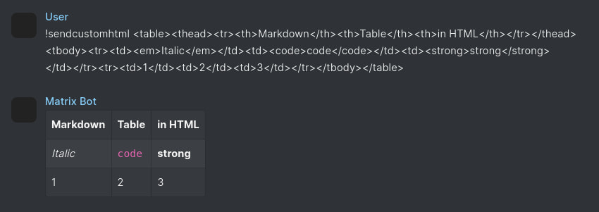

# send-custom-html

Have the bot send a message as custom HTML.

## [Download >](releases)

 

## Notes

- This bot can be dangerous, and is only meant for debugging purposes to test HTML message formatting.
