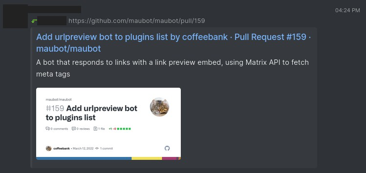

# urlpreview

A bot that responds to links with a link preview embed, using Matrix API to fetch meta tags

## [Download >](releases)

- [Join our Matrix room >](../../../#readme)

 

## Config

- `ext_enabled` - Change which data sources to use for meta tags (last in array takes priority)
- `max_links` - Change how many links you'd like to process per message. 1-3 is recommended.
- `max_image_embed` - Change the maximum image width displayed in the embed. 300 is recommended.
- `no_results_react` - Adds a reaction emoji to the message to show that no results were returned. Put `''` to disable.

### Matrix Synapse URL Previews API

This is optional, but highly recommended for a better experience.

- `appid` - Your bot's access token. This is needed to make the request to the Matrix Synapse URL Preview API.
- `homeserver` - Your homeserver (matrix-client.matrix.org by default, don't add https in front)
- ~~`min_image_width` - Change the minimum image width before the bot sends an image. 475 is recommended to avoid favicons. (To be restored soon)~~

### Upgrade Guide

If your Config is missing some entries above, in your Maubot Manager's Instances, please click "Save" (even with no changes) to force-update the default Config values.

To reset to default values, delete the whole line (ie. to reset `ext_enabled`, delete the whole `ext_enabled: []` line) and click "Save".

## Usage

Sending any link in chat will have the bot reply to your message with the link's embed details.

The bot will first mark the chat as read, to indicate that it has initiated properly.

If there are multiple links in the message, the bot will fetch up to `max_links` (3) links using aiohttp. If it fails, it will skip embedding that link.

If the link returns a 404, the bot will return an emoji `no_results_react` (💨) on your message, to show that no results were returned.

## Notes

- This bot comes with two parsers: `htmlparser` and `synapse`. By default, both are enabled.
- You can control which ones to enable/disable or prioritize using `ext_enabled` (last in array takes priority).

### htmlparser

- `htmlparser` works out-of-the-box by directly fetching the HTML page and parsing using `htmlparser` (built-in).
- This may leak your server's IP, and is recommended for bots hosted in a VPS/server environment.
- Some sites protected by Cloudflare/similar services may not return results.

### synapse

- `synapse` depends on the [Matrix Synapse URL Previews API](https://matrix-org.github.io/synapse/latest/setup/installation.html?highlight=url%20previews#url-previews).
- `synapse` requires you to specify an `appid` and `homeserver` that runs Synapse and supports URL Previews.
- Synapse URL Previews works best with the default [matrix.org homeserver](https://matrix.org/legal/terms-and-conditions/).
  - Some homeservers return 404s at an increased rate. You can check your homeserver's acceptance [on Hoppscotch *(update BOT_ACCESS_TOKEN in Headers)*](https://hopp.sh/r/wpEdCHsQ8YHM)

 

- Due to the length of some embeds, line-breaks are stripped from any `og:description` tags.
- Image width is hardcoded at `max_image_embed` px wide. There may be an option in the future to install a dependency that'll parse image height.
